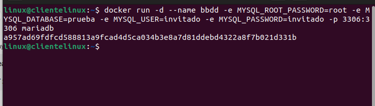
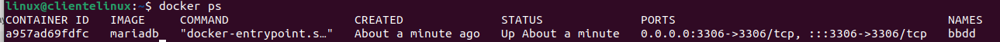
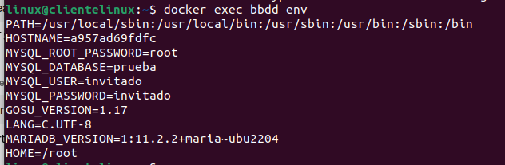

# Ejercicio 1. Servidor de Bases de Datos

> María Clemente Luengo. 
>
> 

---

# Ejercicio 1 - Servidor de base de datos

### Paso 1: Crear el contenedor "bbdd" con MariaDB

```bash
docker run -d --name bbdd -e MYSQL_ROOT_PASSWORD=root -e MYSQL_DATABASE=prueba -e MYSQL_USER=invitado -e MYSQL_PASSWORD=invitado -p 3306:3306 mariadb
```



### Paso 2: Verificar que el contenedor está corriendo

```bash
docker ps
```



### Paso 3: Verificar la configuración de las variables de entorno

```bash
docker exec bbdd env
```



### Paso 4: Capturas de pantalla

- [x] Captura de pantalla de las variables de entorno configuradas en Docker Hub.
- [x] Captura de pantalla de acceso al archivo "index.html" desde un navegador.
- [x] Captura de pantalla de la salida del script "mes.php" desde un navegador.
- [x] Captura de pantalla del tamaño del contenedor web después de crear los archivos.

### Paso 5: Verificar la conexión al servidor de base de datos desde un cliente externo

_Utiliza un cliente de base de datos como MySQL Workbench o phpMyAdmin desde tu computadora para conectarte al servidor de base de datos utilizando las credenciales proporcionadas (usuario "invitado", contraseña "invitado", base de datos "prueba")._

### Paso 6: Intentar eliminar la imagen mariadb mientras el contenedor "bbdd" está creado

```bash
docker rmi mariadb
```

_Esto debería arrojar un mensaje de error indicando que la imagen no puede ser eliminada porque el contenedor "bbdd" aún la está utilizando._

---

