# Ejercicio 1. Servidor de Bases de Datos

> María Clemente Luengo. 
>

### Crear el contenedor "bbdd" con MariaDB

```bash
docker run --name bbdd -p 3306:3306 -e MYSQL_ROOT_PASSWORD=root -e MYSQL_DATABASE=prueba -e MYSQL_USER=invitado -e MYSQL_PASSWORD=invitado -d mariadb
```

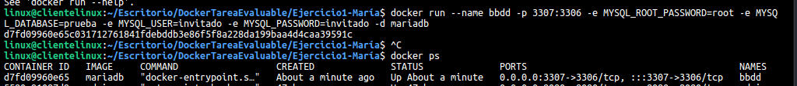

### Verificar que el contenedor está corriendo

```bash
docker ps
```

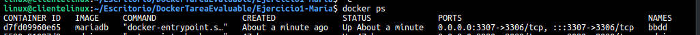

### Creación archivos index.html y mes.php

```bash
nano index.html
```

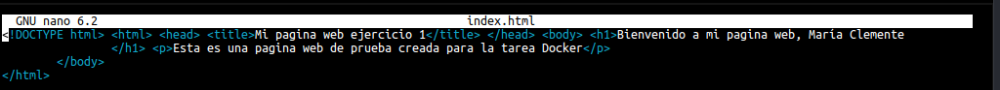

```bash
nano mes.php
```

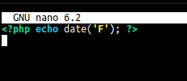

```bash
sudo docker run -v /home/linux/Escritorio/DockerTareaEvaluable/Ejercicio1-María:/var/www/html -p 80:80 -d php
```


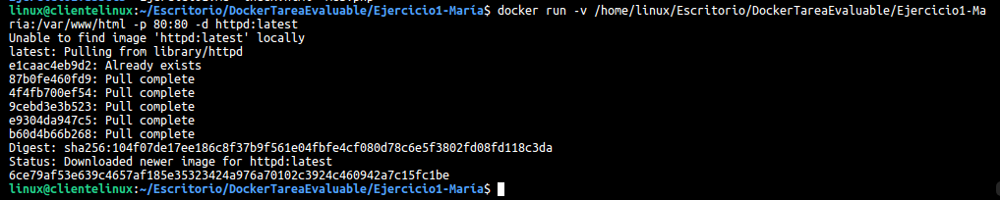


### Capturas de pantalla

- [x] Captura de pantalla de acceso al archivo "index.html" desde un navegador.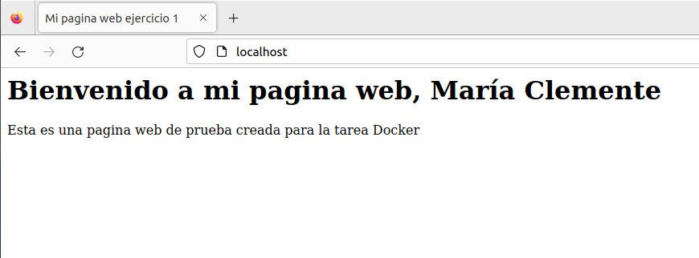

- [x] Captura de pantalla de la salida del script "mes.php" desde un navegador.

  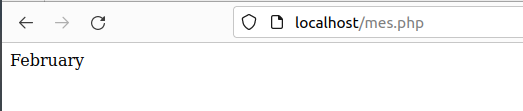

- [x] Captura de pantalla del tamaño del contenedor web después de crear los archivos.

  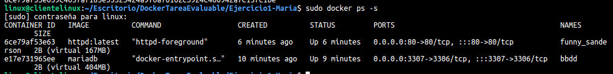

  

- [x] Captura de pantalla y documento donde desde un cliente de base de datos (instalado en tu ordenador) se pueda observar que hemos podido conectarnos al servidor de base de datos con el usuario creado y que se ha creado la base de datos prueba ( `show databases` ). El acceso se debe realizar desde el ordenador que tenéis instalado docker, no hay que acceder desde dentro del contenedor, es decir, no usar docker exec .

​	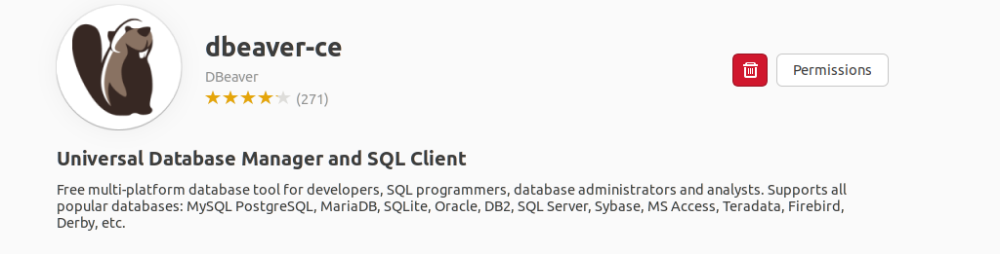

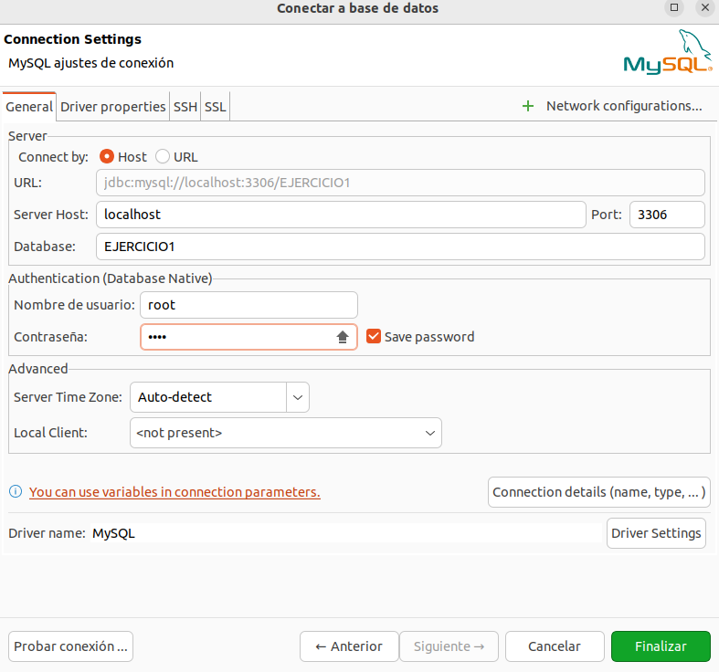

_Mostrar los contendores que estám creados y arrancados_

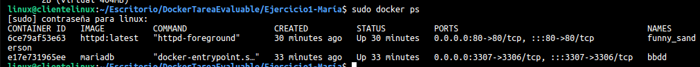

_Eliminar contendor con imagen mariadb_

```bash
docker rmi mariadb
```

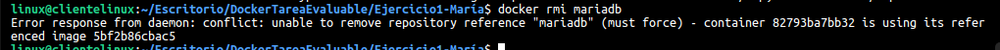

---

