#	EJERCICIO2-PORTAINER

###	Realizado por Raquel.


**-Instalación de portainer:**

```bash
sudo docker volume create portainer_data
```

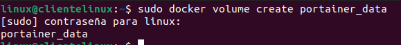

```bash
sudo docker run -d -p 9000:9000 -v /var/run/docker.sock:/var/run/docker.sock -v portainer_data:/data --name portainer portainer/portainer
```

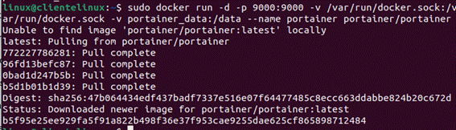


**-Accedemos desde el navegador a http://localhost:9000 :**

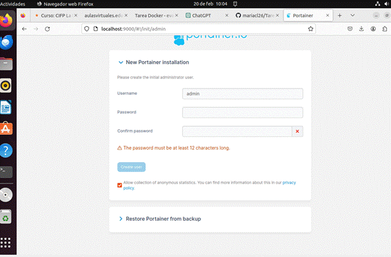

Contraseña : desarrolloweb.

Ya estamos situados en la interfaz de portainer.

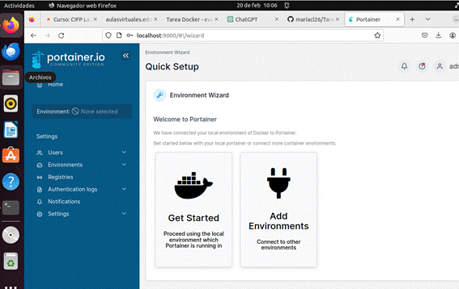


**-Gestionamos el contenedor.**

Esta es la interfaz de los contenedores:

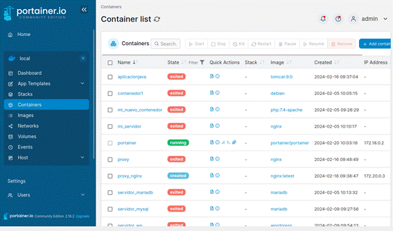

Creo un contenedor:

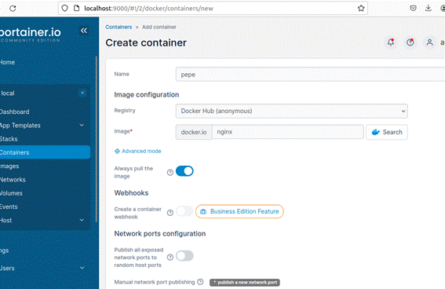

Y compruebo su correcta creación:

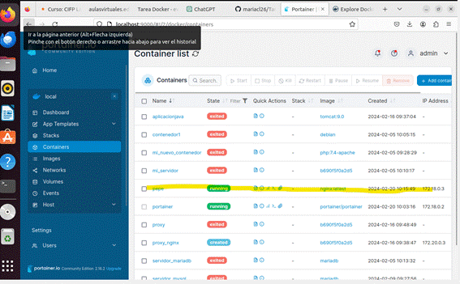

Eliminamos el contenedor:

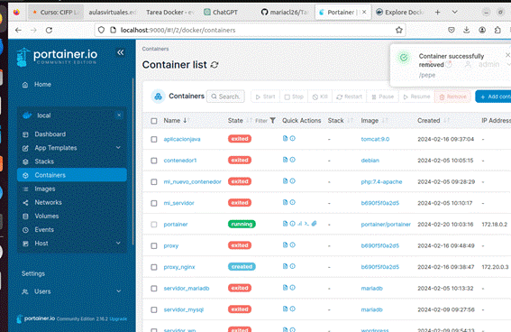

 


**-Operación con redes Docker**

Panel de las redes:

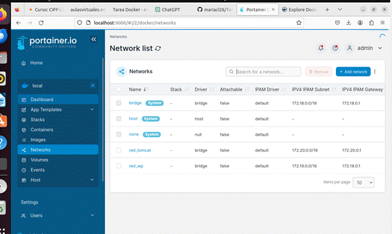 

Voy a conectar una red a un contenedor nuevo:

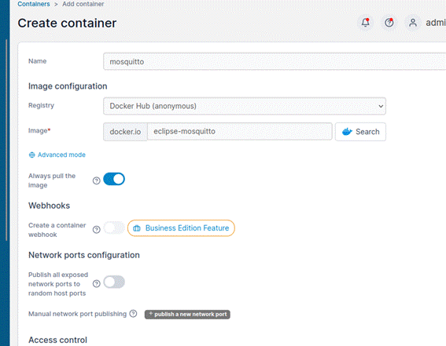

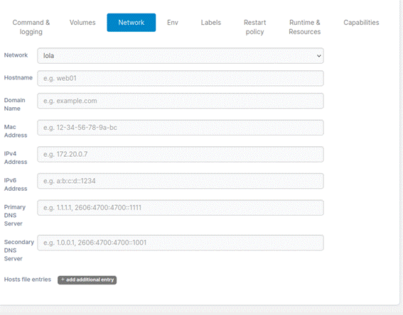

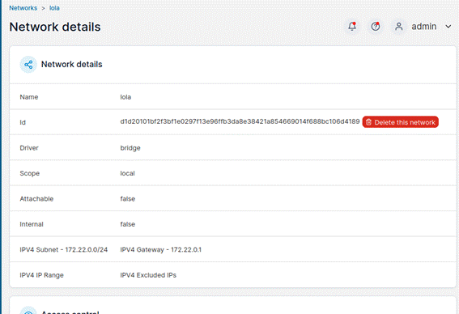

Comprobamos que la red ha sido creada correctamente:

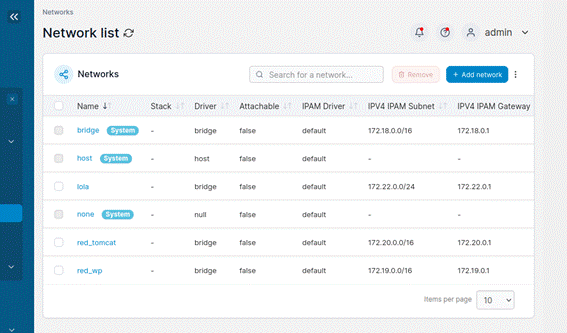

Como se muestra, se comprueba que la ip del contenedor es la misma que la de la red lola, por tanto, se han conectado correctamente.

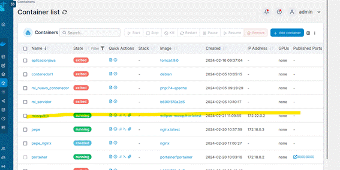

 

 

**-Operaciones con volúmenes Docker:**

Creo el volumen.

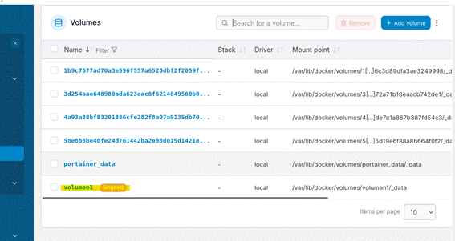

Creo un contenedor nuevo asociándole el volumen1 creado:

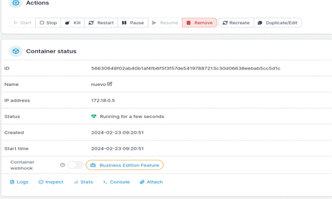


Y lo compruebo:

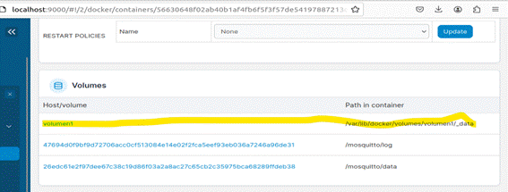