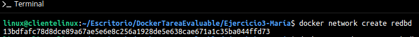
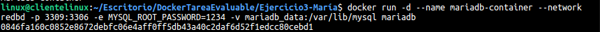
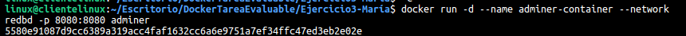
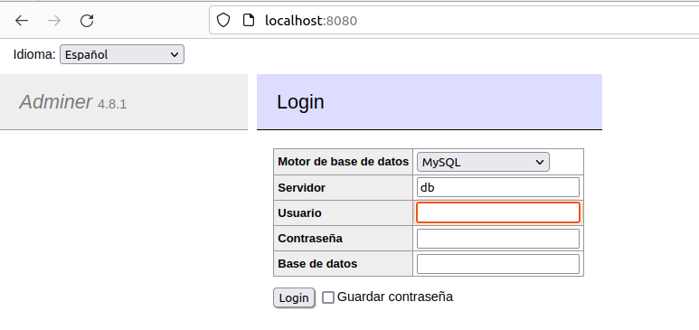
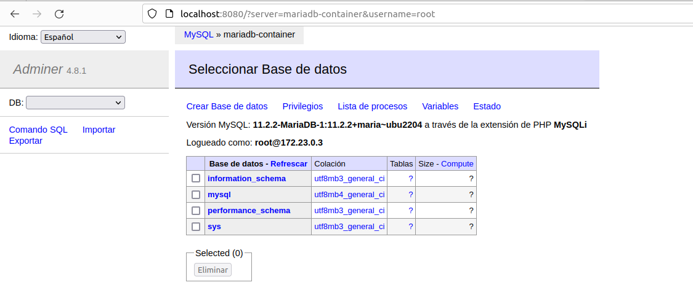
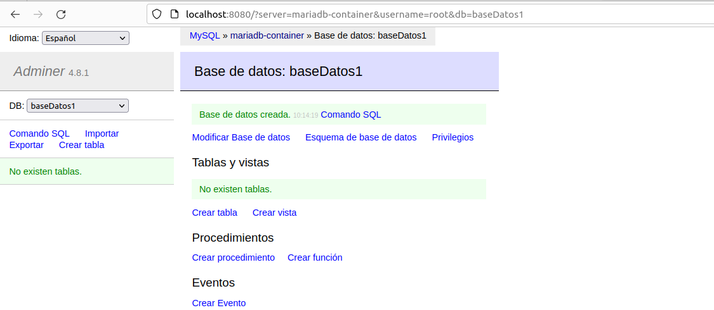
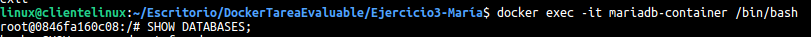
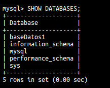

# Ejercicio 3. Contenedores en red: MariaDB y Adminer.

> María Clemente Luengo. 

1. **Crear una red bridge:**  

   ```bash
   docker network create redbd
   ```

   

2. **Crear un contenedor de MariaDB:**  

   ```bash
   docker run -d --name mariadb-container --network redbd -p 3309:3306 -e MYSQL_ROOT_PASSWORD=1234 -v mariadb_data:/var/lib/mysql mariadb
   ```

   

3. **Crear un contenedor de Adminer:**  

   ```bash
   docker run -d --name adminer-container --network redbd -p 8080:8080 adminer
   ```

   

4. **Verificar la conexión entre Adminer y MariaDB:**  

   ##### Captura de pantalla y documento donde se vea el acceso a la BD a través de la interfaz web de Adminer

   

   

##### Captura de pantalla y documento donde se vea la creación de una BD con la interfaz web Adminer





##### Captura de pantalla y documento donde se entre a la consola del servidor web en modo texto y se compruebe que se ha creado la BD

