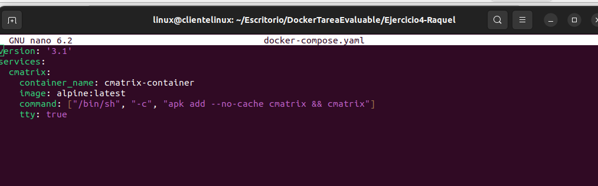
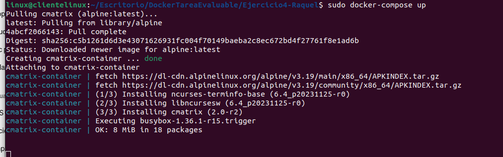
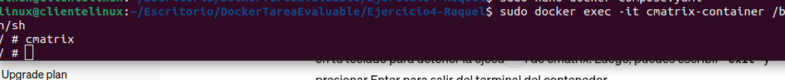
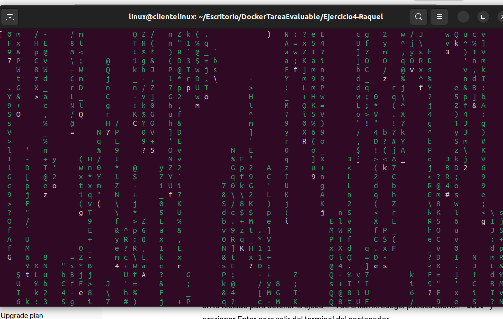

# Ejercicio 4. Docker Compose.

> Raquel Cabezas. 

Desplegar la aplicación cmatrix utilizando docker-compose.

**-Captura de pantalla y documento donde se vea el fichero docker-compose.yaml .**

```bash
sudo nano docker-compose.yaml
```




```bash
sudo docker-compose up
```



**-Captura de pantalla y documento donde se vea la aplicación funcionando. Se valorará conseguir el efecto Greenrain.**

Ejecuto el siguiente comando para entrar en la terminal del contenedor. Y pngo cmatrix para iniciar la aplicación.

```
sudo docker exec -it cmatrix-container /bas
```






**-Explicar brevemente cómo funciona esta aplicación.**

La aplicación cmatrix es un programa que simula la clásica "lluvia de caracteres" que se ve en muchas películas de ciencia ficción. Funciona simulando una matriz de código en movimiento dentro de una terminal de texto. Cada carácter individual de la matriz se desplaza aleatoriamente hacia abajo, creando el efecto visual de una lluvia de código en pantalla. Es una especie de representación de la informática en la cultura pop, particularmente en el género de la ciencia ficción.