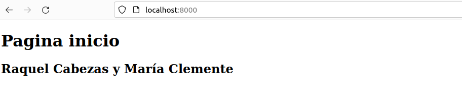
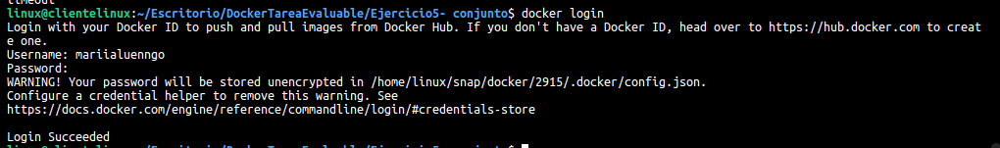

# Ejercicio 5. Imagen con Dockerfile - Aplicación Web. 

> María Clemente y Raquel Cabezas. 

Para la realización de este ejercicio es necesario tener una cuenta en Docker Hub.

## Creación inicial del contenedor - documenta los pasos hasta el borrado del mismo

**Creación cuenta en DockerHub**


**Creación del index.html**


**Creación del mes.php**


```bash
docker run -d --name web -p 8000:80 -v /home/linux/Escritorio/DockerTareaEvaluable/Ejercicio5-\ conjunto/:/var/www/html php:7.4-apache
```


_Entramos al navegador desde el puerto 8000_



_Salida del script del mes.php_


***Borrar contenedor***

1. Parar

2. Borrar

   

   

## Bloque de código con el Dockerfile

```bash
nano Dockerfile
```


#### Captura de pantalla y documento donde se vea el comando que crea la nueva imagen.

```bash
docker build -t my-php-web .
```


#### Captura de pantalla y documento donde se vea la imagen subida a tu cuenta de Docker Hub.

_Inicio de sesión en Docker_

```bash
docker login
```



_Imagen_

```bash
docker tag my-php-web mariialuenngo/my-php-web
```


```bash
docker push mariialuenngo/my-php-web
```


#### Captura de pantalla y documento donde se vea la bajada de la imagen - por parte de otra persona del grupo - y la creación de un contenedor.


#### Captura de pantalla y documento donde se ve el acceso al navegador con el sitio servido