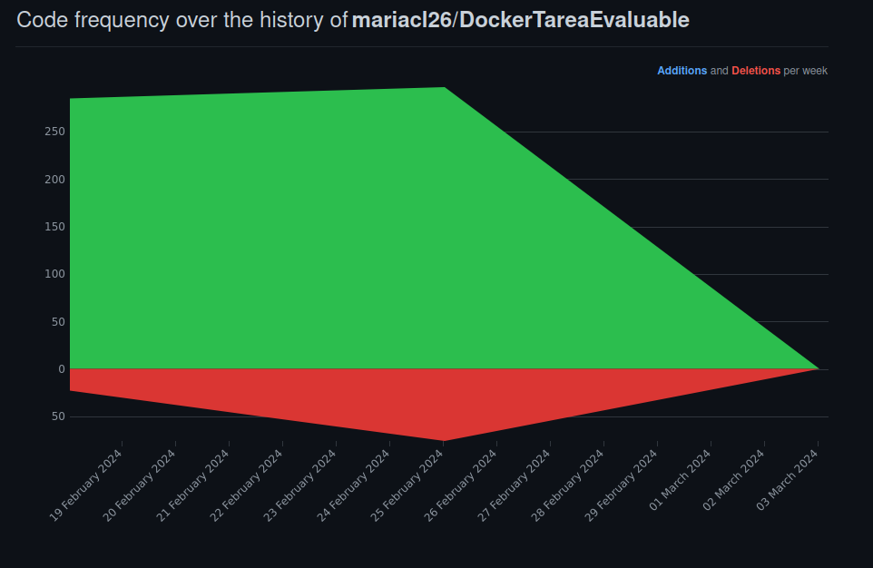

# Docker Tarea Evaluable:
Tarea Docker colaborativa.  
> Raquel Cabezas y María Clemente.
> Despliegue de aplicaciones web.

Tarea conformada por 5 ejercicios, divididos de la siguiente forma:

- María: Ejercicio 1, Ejercicio 3.
- Raquel: Ejercicio 2, Ejercicio 4.
- Ambas: Ejercicio 5.

Repartición de las tareas:

##### Issues:

##### Commits: 

##### Gráficos sobre el proyecto:

****

